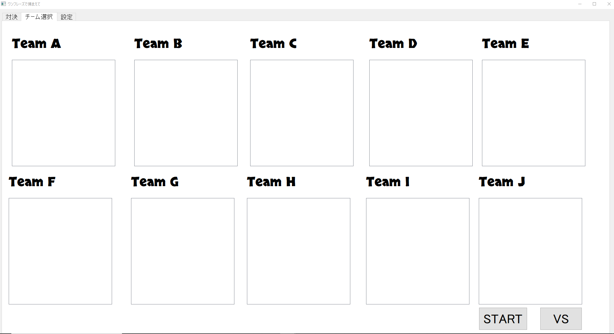
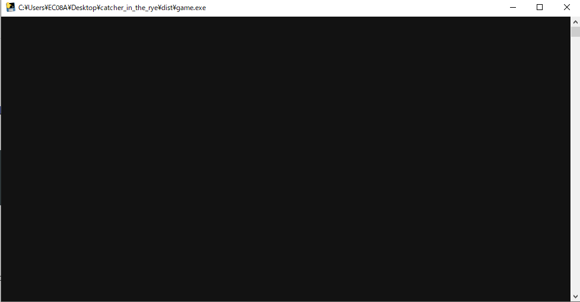
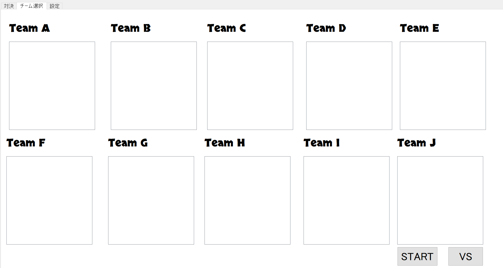
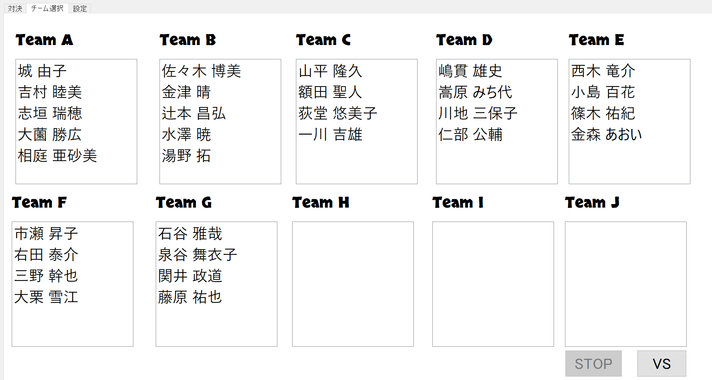
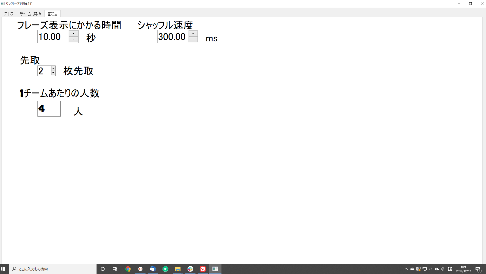

# ワンフレーズで捕まえて

## 概要

宴会で活躍するオリジナルゲーム`ワンフレーズで捕まえて` ゲームの、ゲームルールおよびソースコード一式です  
結構盛り上がったのでやってみてください一応遊べる、くらいでいろんな例外を想定していません :fire:
PyQtを使用していますので、クロスプラットフォームで使用できます(Linuxは要XWindow)  
10人以上を推奨しています  
* 進行役1名と、その他大勢(チーム戦)に分かれて遊ぶゲームです  
* 2チームでの対決を想定しています
* 実際はトーナメント表を紙で作成して遊びました
* 進行役はあらかじめ、参加者全員のエピソードやキャッチフレーズを考えておきます  
* ランダムなキャッチフレーズが読まれたら、チームは実際に、そのキャッチフレーズが指す人を探しにいきます
* 先に探して捕まえたチームにポイントが入ります


## 必要
* 1920 x 1080解像度のディスプレイ
* 適当なディスプレイ
  - 我々が使用した際は、ノートPC ＋ プロジェクタ でやりましたしこの事しか考えてません

## releases

以下リンクより、Windows向け実行ファイルをダウンロードできます。環境構築が不要でおすすめです！
[Release](https://github.com/mews-iidx/catcher_in_the_rye/releases/download/v1.0/dist.zip)

## csv加工
* `dist/data/test_data.csv`を編集しますテストデータにならい、実際の人とフレーズを入れてください
* このとき、進行役はデータに含めてはいけません
* 実際にゲームに参加する人だけを追加してください

```csv
氏名,フレーズ1, フレーズ2, フレーズ3, フレーズ4
一川 吉雄,不老不死になる予定,世界平和,遠くの焼肉より近くのラーメン,会社で画面が一番多いひと
右田 泰介,自転車,ロードレース,話しかけた時の対応がお医者さんみたい,実は利き酒師
荻堂 悠美子,口癖：たしかに,10月の展示会の打上げメンバー「With〇〇」,指さす時に画面触るとよごれません？,稟議
額田 聖人,新橋からバスで会社まで来てる（なぜ歩かない？）,早口×生産性の高いママ,旦那さん、飲めないのにお酒関連の資格を持っている,
関井 政道,ポケモン,業務整理＆効率のスペシャリスト,ゲーミングPC所有者,ヤドン
吉村 睦美,サウナ,派手にするのは靴下だけ,靴下どこで買ってるんですか？,実は労務になっている
金森 あおい,スピリチュアル・動物占い,変なとこで笑う,多分ネジが数本足りない,シラフでバグるヘッドハンター
金津 晴    ,前回の社員旅行でアニソン歌ってた,8月誕生日×懸垂記録9回,腰パンですがパンツは見えません,ラーメン
佐々木 博美,バースデーソング歌う人,寝袋×人徳,絶対王者,数値がもはや会社
```

## 準備

* リーグなりトーナメント表なりを勝手に準備してください残念ながらチームの勝ち抜き状況を管理する仕組みはありません
  - 我々はトーナメントで遊びました
* 各ゲーム2チームで戦うことになります

## 実行

`main`を実行します

| platform | name |
| ------- | ------ |
| Windows | main.exe |
| Linux | ./main |

プロジェクタ側のディスプレイに以下を表示します



ノートPC側のディスプレイに以下を表示します(進行役専用,回答が表示されます)



## チームの決定

* start を押すとチームがシャッフルされます
* チームが決定したら進行役は会場内でまとまるように指示してください



## ゲームの流れ

1. チーム名を押すと赤になって選択できます
1. 対決する2チームを選択し、VSを押すと対決開始します
1. NEXTを押す事でフレーズが表示されはじめます
1. 各チームはNEXTを押した瞬間から、会場内にいる該当者を探しに行きます
1. 見つけたら｢この人です！」って高らかに宣言しましょう
1. あっていれば進行役は｢正解！｣と宣言して、該当のチームに得点を入れます
1. どちらかが特定の点数を先取したとき、終了します
1. congratulationsウィンドウが出たらEnterで終了します




## 設定の編集



### フレーズ表示にかかる時間

全フレーズが表示完了されるまでの時間です

### 先取

文字通りだ

### 1チームあたりの人数

* 4人にしたとき、ランダムで4人のチームを編成します
* 割れずにはみ出た分は適当なチームが5人になります


### シャッフル速度

* シャッフルで待つ秒
* 0.1とかにすると高速でシャッフルできます
