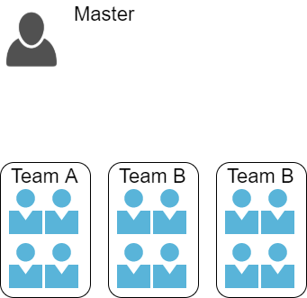

# ワンフレーズで捕まえて for Engineer

[エンジニアでない方はこちらをご覧ください。](README.md)

## 概要

宴会で活躍するオリジナルゲーム`ワンフレーズで捕まえて` ゲームの、ゲームルールおよびソースコード一式です。  
エンジニア向けの手順書です。[エンジニアでない方はこちらをご覧ください。](README.md)  
PyQtを使用していますので、クロスプラットフォームで使用できます。(Linuxは要XWindow)  
install手順は[こちら](installation.md)(WindowsにPythonをインストールしてない人向け)  
10人以上を推奨しています。  

## どんなゲーム？

* 進行役1名と、その他大勢(チーム戦)に分かれて遊ぶゲームです。  
* 2チームでの対決を想定しています
* 実際はトーナメント表を紙で作成して遊びました
* 進行役はあらかじめ、参加者全員のエピソードやキャッチフレーズを考えておきます。  
* ランダムなキャッチフレーズが読まれたら、チームは実際に、そのキャッチフレーズが指す人を探しにいきます。
* 先に探して捕まえたチームにポイントが入ります

1. `dist/test/data.csv`を編集します。テストデータにならい、実際の人とフレーズを入れてください
    - このとき、進行役はデータに含めてはいけません。

1. チームがランダムで編成されます。

1. 各参加チームより1人代表者が指定されます。  

1. 進行役がランダムなフレーズを読む  

1. 参加者は、`そのフレーズが指している人`を探して捕まえます。

1. 捕まえた人の在籍するチームに得点！

## 必要機材

* 画面(必要に応じてスクリーンやプロジェクタ)
* 今後画面が必要ないモードも実装します。

## 課題

ちょっとランダム性があって逆転要素とかあれば楽しい

## releases

以下リンクより、Windows向け実行ファイルをダウンロードできます。環境構築が不要でおすすめです！
[coming soon.](https://google.com)

